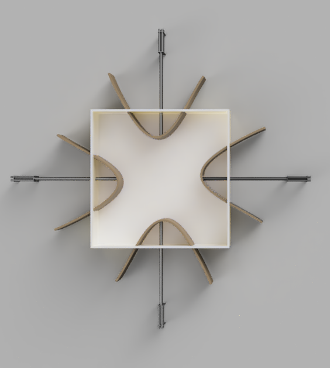

**CAD Model**

The mold consists of four moveable arms which are made of five bars with different dimensions, two rectangular flat surfaces. They will be assembled as shown in the figure below. 

Arduinos will be placed on the frames designed at the arm endpoints. 

These arms are connected to four adjustable walls with elastic surfaces that expand/detract alongside X- or Y-axis within a base to customize the shape and dimension of the mold. The material used for these surfaces is to be decided and cut in the desired sizes. The mold base is designed in Fusion 360 program and will be 3D printed. As mentioned, walls will be adjusted by moveable arms. 

