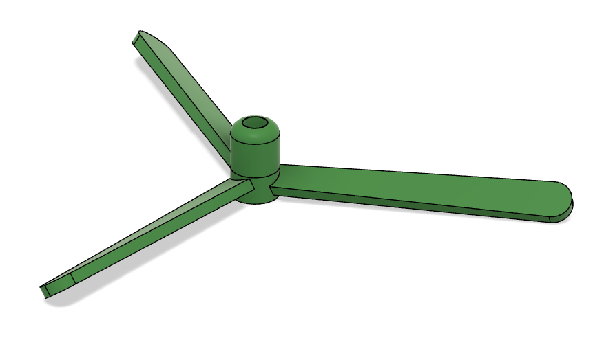
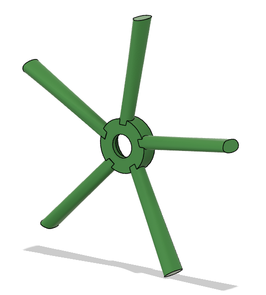
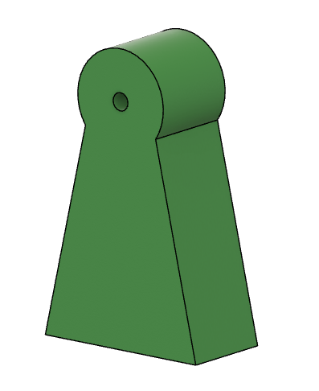
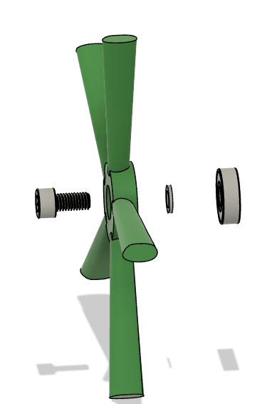
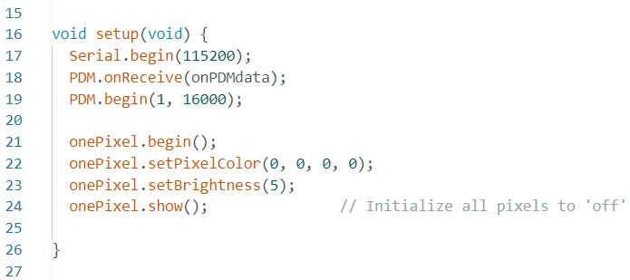
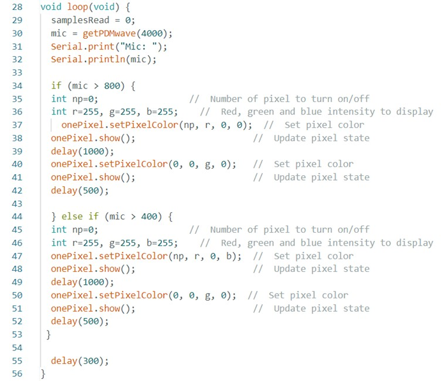

**3D print**

The current assignment was to 3D print an object with multiple elements as fabricable as possible. The preferred design for 3D printing is a windmill. To create this, I started by designing the blades using Fusion 360 software. Initially, I drew the central part of the blades with the "circle" and "extrude" commands. Then, I utilized the "Loft" command to create the blade's shape. To achieve the curved profile of the blade, I worked with two different angles for two profile sections.
The initial design of blades was as shown in Figure 1, which was later modified as shown in Figure 2.

Figure 1.

Figure 2.

Once the first blade was completed, I implemented the Circular Pattern command to determine the number of blades according to the desired design.

After designing the blades, I proceeded to create the windmill base. With both the blade and base ready, I used the "Joint" command to connect them.

Figure 3.

To assemble the blade onto the base, external components such as bearing, spacers, and screw were required to model the practical aspects of a windmill.

Figure 4.

For the final 3D print, I chose to use the Bamboo program. The final design met my goals, however, during the printing process, I encountered an issue where a portion of the first layer of the blade didn't adhere to the print bed. To address this, I had to use support structures to ensure a successful print.

Figure 5.

The final product of this assignment is shown in the Figure 6 below.

Figure 6.

