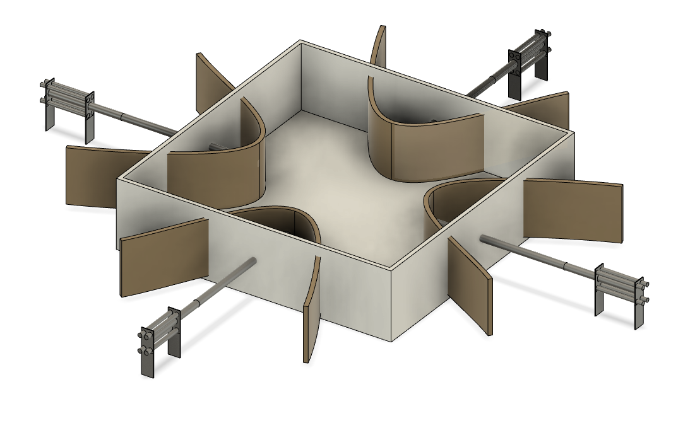

**3D print**

The assignment this week was to 3D print something. The preferred design for 3D printing is a windmill. To create this, I started by designing the blades using Fusion 360 software. Initially, I drew the central part of the blades with the "circle" and "extrude" commands. Then, I utilized the "Loft" command to create the blade's shape. To achieve the curved profile of the blade, I worked with two different angles for two profile sections.
The initial design of blades was as shown in Figure 1, which is modified to Figure 2.

