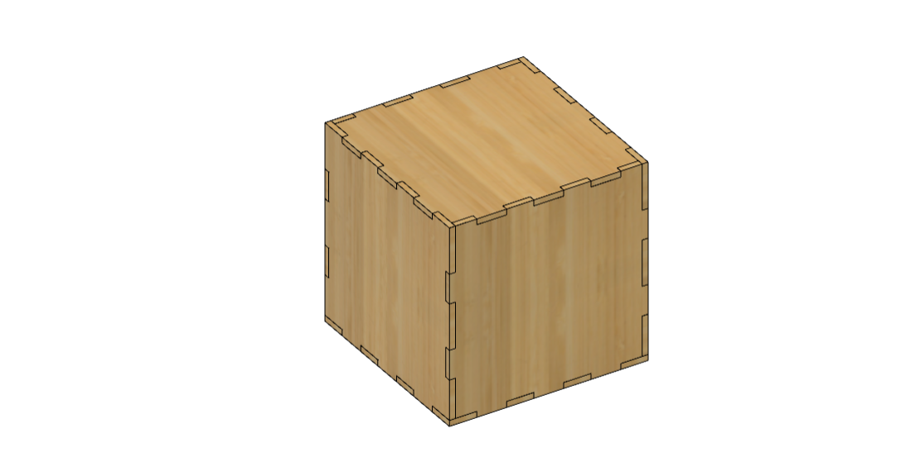

**Laser Cutting**

This assignment is to design a finger-joint box using Fusion 360. Creating the bottom surface was the first stage and this was carried out by creating a component and forming a rectangle with the desired dimensions. Subsequently, I generated a series of rectangles for the finger joints, mirroring them to align with both sides. This process was repeated for each side of the box. Once the design was complete, I extruded it to achieve the desired thickness.

After creating one side, I employed the mirror component command to duplicate it on the opposite side. To unify all the sides together, I utilized the combine command. To ensure there were no issues, I employed the component colour cycling toggle, which allowed me to identify any component overlapping. If such issues arose, I utilized the combine command with the cut operation to solve the issue.

This is final product of laser cut process:

**Technical potensials of laser cut in final project**

Laser cutting offers several advantages, which makes it a popular choice for various applications. This technology is a fast process, allowing for efficient production. It can cut complex shapes quickly, which is advantageous for mass production or rapid prototyping.
Even though in my project it is better to 3D print the mold base to prevent leakage, there are several ways I can leverage laser cutting for my final project. I can use it to make a base that the mold with four moveable arms can be placed on it. Furthermore, for the flexible walls I can use laser cut to make hinges instead of finding flexible material. Laser cutting is ideal for engraving lines with short distances to make a surface more flexible. 
