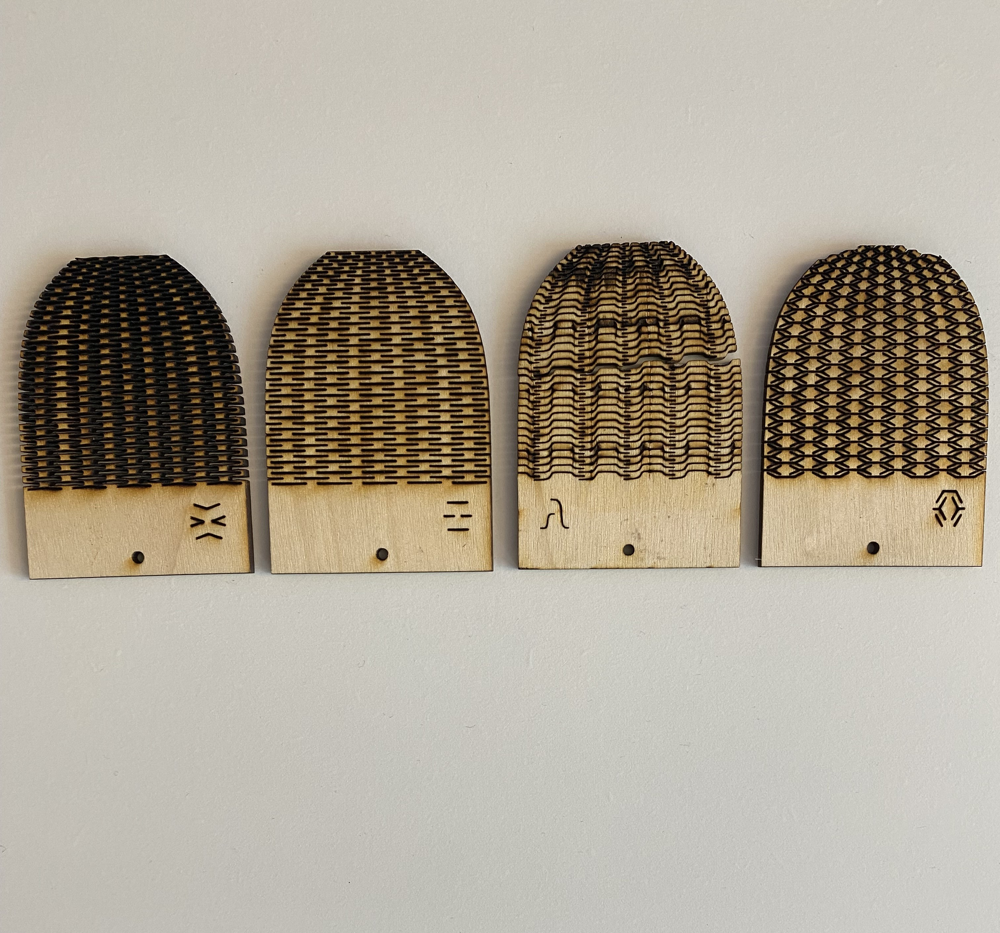

**Prototype 1**

**Description of the selected prototype**

The adjustable mold which is the prototype to be built in this assignment is to enhance architectural design by allowing the production of concrete bricks in various shapes and sizes. This adjustable mold is designed to avoid repetitive patterns and add an artistic touch to architectural designs while maintaining efficiency in terms of time and cost. In essence, its primary purpose is to enable architects and builders to create unique and innovative architectural elements using concrete bricks, thereby pushing the boundaries of conventional practices and opening new possibilities in architectural design.

**Details of the prototype and the materials**

The mold base is 3D printed in the lab. The choice of 3D printing over laser cutting for the base is driven by the need to minimize potential openings, thus preventing any leakage during the brick-making process. (Figure 1)

Figure 1.

The walls are constructed from 3 mm thick wood with a repetitive pattern that gives flexibility. Initially, four distinct patterns were laser-cut and assessed to ascertain which one best met the desired level of flexibility. (Figure 2)

Figure 2.

Finally, the pattern in the right showed the desired level of flexibility and was adopted on a larger scale as the final wall for the mold. (Figure 3, Figure 4)

Figure 3.

Figure 4.

There are two openings per each side of the base to let the flexible walls to let the walls arms move.

After a few try and errors, it was determined that constructing the inner surface of each opening at a 45-degree angle enhanced movement and ease of use. (Figure 6)

Figure 6.

**Learnings, missing parts and potential improvements in the design and prototyping**

There are several learnings from this assignment. First, the material designed and used will not always work as theoretically expected. Prototyping helps a lot to test the fabrication method and the practicality of the material used. For example, can moveable walls be built by using different material or pattern which makes them more flexible. The contact point, the moveable arms moving through the openings, are another important learning. An oriented surface helps a lot to smooth the movement and avoids extra friction that causes quick wear out of the part in long-term use.
At this stage, it doesn’t look to have anything missing, but there are some potential improvements. An improvement or task for the next phase could be to implement a motor in combination to a gear for each of the moveable walls to make them move and get adjusted to the pattern a final brick will be produced to. 
Another improvement could be to use a plastic-like (or silicon, etc) material to be used for the walls instead of the current wood. This is to guarantee flexibility of the wall without need for laser cut and empty spaces in those. These empty spaces could be filled out by cement or other water-based mixtures during the use and cause problems in the moveable arm. Furthermore, wood is susceptible to erosion when exposed to water and there will be need to replace them more often.
 

**The way forward**

As per this assignment, a prototype is built and several parts are separately re-printed and laser-cut afterwards to try and test different improvements. Flexibility, friction, dimensions, etc are the main parameters tested. Next step will be to repeat this step (building this prototype) with everything 3D printed and laser-cut in their final improved design and test that everything will work fine together. Simply said, another trial fabrication of the prototype is necessary to make sure the fabrication will go smoothly. 

