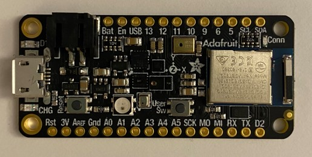

**Input-Output**

**Introduction**

This week's assignment is all about exploring microcontrollers, which are like tiny computer brains. They're used to measure various inputs like humidity, sound, proximity, etc and making things happen (outputs) based on those measurements. This project will help us learn the basics of microcontrollers and get ready for our big final project. For this assignment, a microcontroller called the Adafruit Feather nRF52840 Sensor is used (see Figure 1).

Figure 1.Adafruit Feather nRF52840 Sensor

There are several aspects of this that can be used in the final project. First, a motor can automate the brick dimension adjustment that are given to the Arduino. Furthermore, I thought of using humidity and/or light sensor for my project to determine when the bricks are adequately dried in the fabrication process. In such a way that the sensors are placed on top of the brick and after the humidity drops below a certain level or the brick colour becomes sufficiently bright, the walls start to open automatically. A certain elapsed time could be added in the program to make sure that the brick walls will not open too soon due to any error or failure.
Another idea I have for my final project is to use a proximity sensor to pour the mortar into the mold. To have a brick with a thickness and 5 cm, place the sensor at a distance of, for example, 7 cm from the bottom of the mold. When the mortar is close to distance of 2 cm from the sensor, it starts beeping.
These ideas should be matured more to be able to implement in the final project.

**Arduino and its applications**

To get to know Arduino, I had a session guided by Max which was to introduce various Arduino components. Together, we wrote a basic program to light up an LED in the lab. Figure 2 represents this preliminary code.

Figure 2.Preliminary code to test Arduino application

**Designing a microcontroller to measure ambient sound level**

The purpose of this set-up is to measure the ambient sound level and to return an LED colour based on that level. In other words, if the sound level is below 400, a green LED will stay on (with a delay of 0.5 second if any change happens). If the level is between 400-800, a purple LED will light up for 1 second, and if this level goes above 800 the purple turns to red for 1 second. In the next section, more details about the Sketch will be presented.

**Arduino Sketch details**

The sketch is started with the include section where different necessary libraries are added.

Figure 3.Include section in the Arduino Sketch

Adafruit_Sensor.h includes Adafruit Sensor Library which allows you to access sensor-related functions and classes in your code. Including Adafruit_NeoPixel.h allows you to use functions and classes for controlling NeoPixel (WS2812) LED strips or rings in your Arduino or microcontroller code. And finally, PDM.h provides access to functions and classes that enable Pulse-Density Modulation (PDM) audio input and output capabilities in your Arduino or microcontroller project. PDM is often used for capturing or generating audio signals. (ChatGPT)

The next part of the sketch (Figure 4) is the section used to define different elements such as constant (NEOPIXELPIN) to assign a pin on Arduino, integer (mic) for 32-bit data, short integer (sampleBuffer) to store audio sample or integer variable (samplesRead) to keep track of the number of the audio samples. The command in the line 7 is to define that onePixel will control the NEOPIXELPIN LEDs and finally the commant in line 11 declares an external reference to the PDMClass.

Figure 4.The definitions in the beginning of the Arduino Sketch

The next section in the Sketch will be Arduino setup function as shown in Figure 5. The first part is to setup the audio function. In this part the sampling rate is set to 16000 which means this many times sound samples will be taken in every second. 

Figure 5.Arduino setup function

The second part in the Figure 5 is to setup and initialize the LED function. The first LED with three colours (RGB) is set-up and the brightness is set to 5 out of 255.

Figure 6 shows the main Loop in the Sketch when the Arduino gets sound samples and if the level is in the range of 400-800 return a purple LED light which turn red if this level goes above 800. The light will stay green at levels below 400.

Figure 6.The main Loop in the Sketch

Finally Figure 7 shows the three different states when the Arduino return three different colours depending on the three different input values. A printout of the sound levels is also shown to highlight the level relevant to each output.

Figure 7.Arduino output LED colours depending on the ambient sound level

**Acknowledgment**

Thanks to Max and Vasileios for helping with introduction to Arduino, Arduino Sketch.

**References**

ChatGPT is used for modifying text and some definitions.

Arduino Sensor Example | Adafruit Feather nRF52840 Sense | Adafruit Learning System

