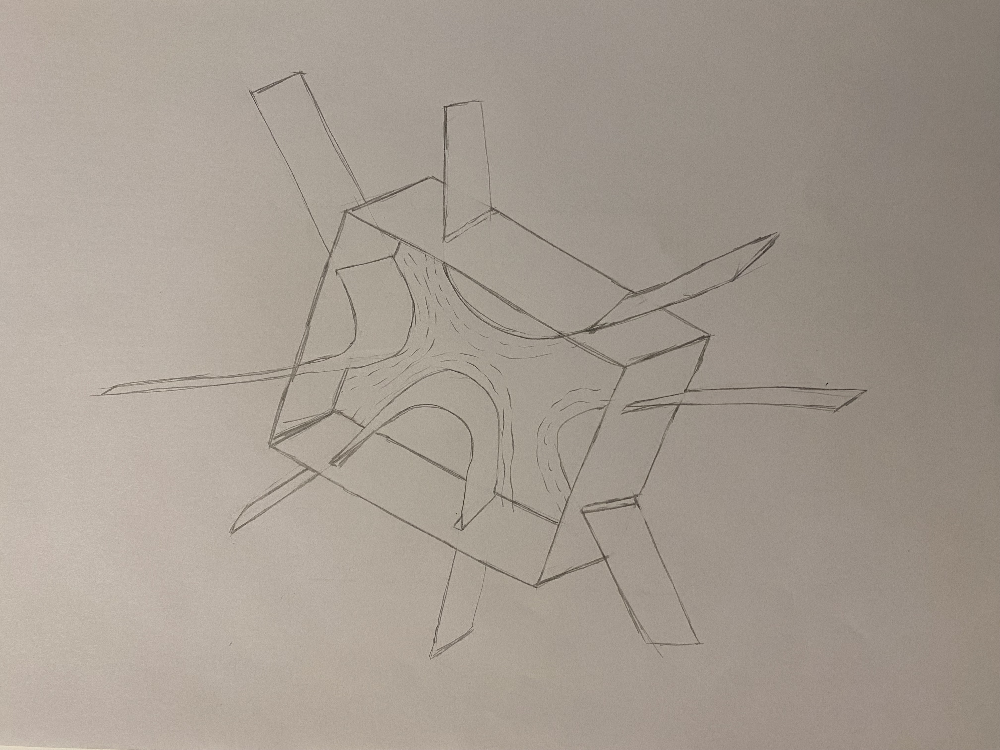
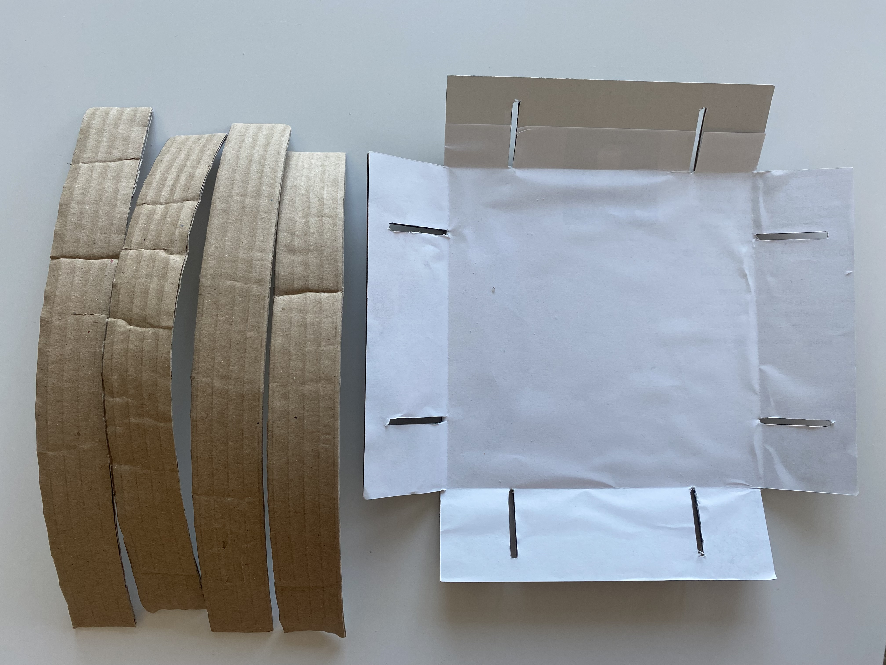
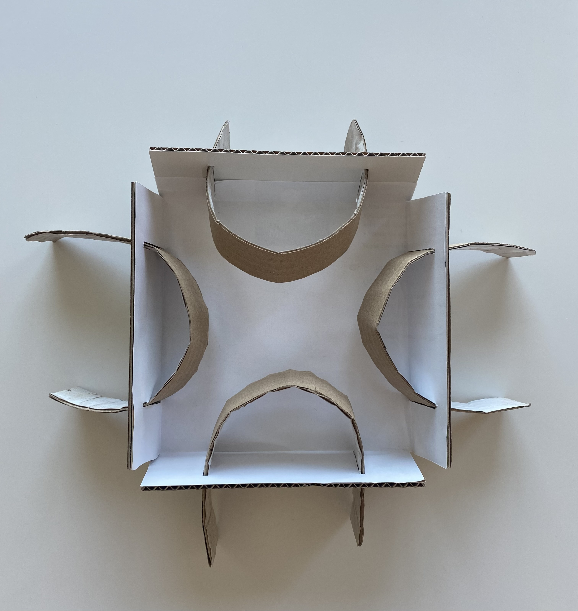
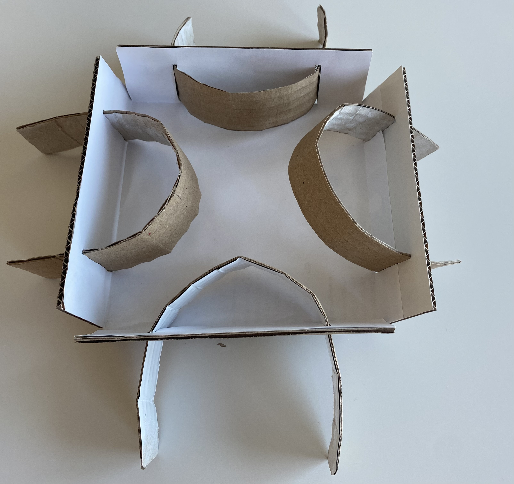

Hey there! Welcome to my cool website where architecture gets a modern twist.

**about me:**
I'm Samira, an architect who loves breaking the rules of regular design and building methods. I've worked in the field of architecture and on differnet projects for some years. Each project is a chance for me to be creative and solve problems. It all began when I was student, learning about design, stability, and materials. I try to think out of the box about how things should look like and find nice ways to make architecture even cooler. Lately, I've been focused on this special concrete brick idea that can change how we create spaces. 

**about the project:**

In the field of architecture, it is always useful to find ways to avoid repetitive patterns and add an artistic touch to the design. At the same time, it should be possible to do this in an efficient way, both in terms of time and cost. The Adjustable Concrete Brick Mold produces concrete bricks in various shapes and sizes. Its transformative capabilities elevate conventional practices, unlocking the potential for extraordinary architectural designs.

The following figure illustrates the preliminary sketch of the design:

To ensure that the design will look good, the first step would be to create a paper model:

The model consists of a container-like base and four adjustable arms as illustrated. These arms give a customized pattern to the bricks.

**Features:**

**Efficient Production Streamlining:** Easily adjustable, which speeds up the brick-making process.

**Sustainable Advancement:** The mold's reusability for different projects promotes eco-friendly construction.

**Smart Savings:** This mold eliminates the need for specialized bricks for each design, reducing production costs and waste.

And last but not least, 

**Endless Creativity:** The adjustable mold will empower designers to experiment with various brick shapes, enabling the creation of stunning and distinctive patterns.

