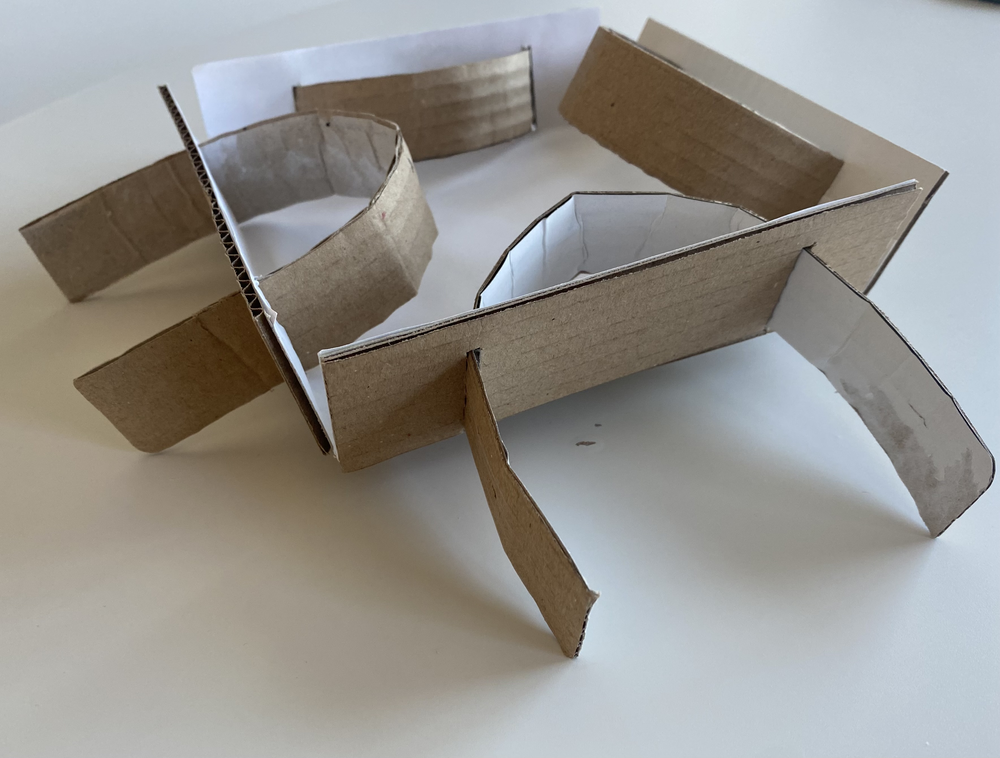

Introduction:
Welcome to my creative website where architecture meets innovation. I am Samira, an architect with a passion for pushing the boundaries of traditional design and construction methods. With a deep understanding of architectural aesthetics and a flair for innovative solutions, I am dedicated to transforming spaces through the development of an adjustable concrete brick mold that promises to improve the way we design and build.

Introduction:
Welcome to my creative website where architecture meets innovation. I am Samira, an architect with a passion for pushing the boundaries of traditional design and construction methods. With a deep understanding of architectural aesthetics and a flair for innovative solutions, I am dedicated to transforming spaces through the development of an adaptable concrete brick mold that promises to improve the way we design and build.

Background:
With three years of experience in the field of architecture, I've had the privilege of being part of many different projects. Each project has been a chance for me to take on new design challenges and come up with solutions. It all started with my degree in architecture, where I learned a lot about design, making sure things are strong and stable, and exploring different materials. This education gave me a solid base, and now I'm always curious and driven to find new ways to make architecture even better.

Unleashing Innovation:
At the heart of this vision lies the creation of an adaptable mold, designed and crafted to effortlessly produce concrete bricks in an array of shapes and sizes. This breakthrough empowers architects, designers, and builders, granting them unprecedented flexibility to craft captivating, unparalleled walls and facades. Its transformative capabilities elevate conventional practices, unleashing the potential for extraordinary architectural designs. This concept's standout features include:

Efficient Production Streamlining
The mold's seamless adjustability accelerates the brick-making process, redefining efficiency in production.

Sustainable Advancement
Its adaptability across diverse projects exemplifies a dedication to eco-friendly construction practices, championing sustainability.

Economically Ingenious
By eliminating the need for customized bricks for each design, the mold significantly reduces production costs and material waste.

Unbridled Creative Expression
Empowering designers to experiment with a plethora of brick shapes, the mold enables the creation of captivating, unique patterns.

Sketch

Priliminary model

